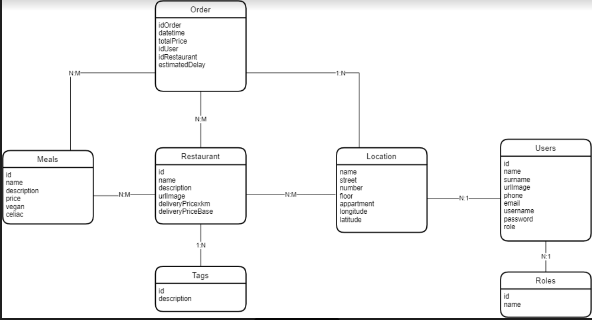

# **TP-TTADS**
Proyecto para la materia "Técnicas y Tecnologías Avanzadas de Desarrollo de Software" de la UTN FRRo

## **Enunciado General**

Desarrollar un sistema de gestion de pedidos online. 

### **Alcance**

Desde que el usuario entra al dominio del sitio, busca los restaurants donde quiere pedir, realiza el pedido y se generan reportes con la informacion del pedido realizado.

 
